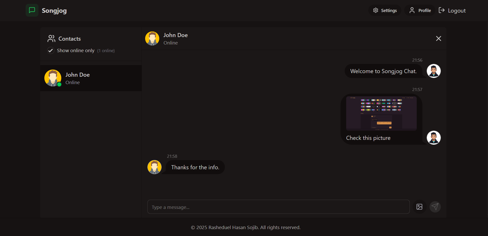
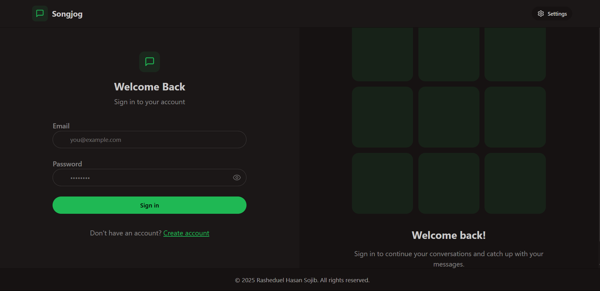
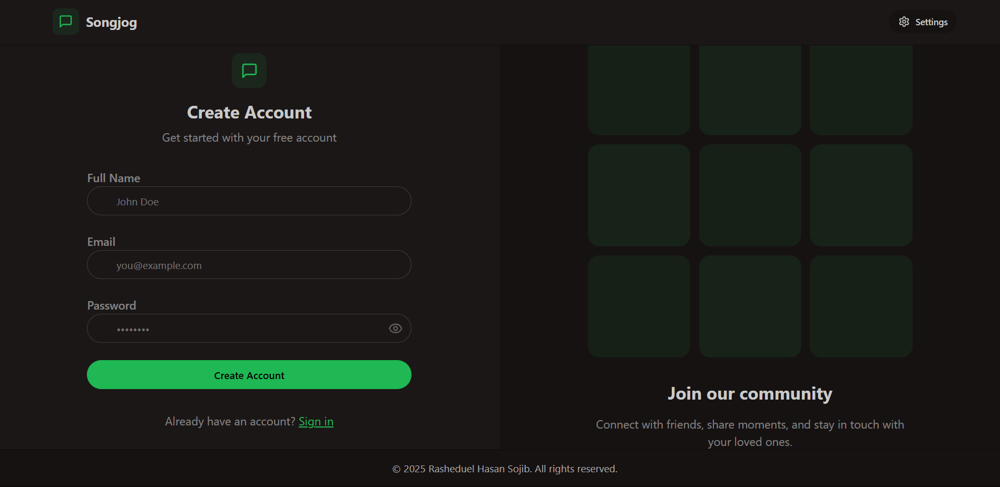
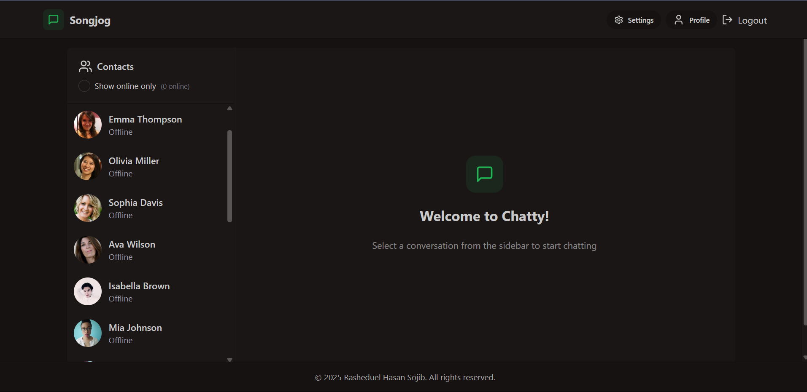
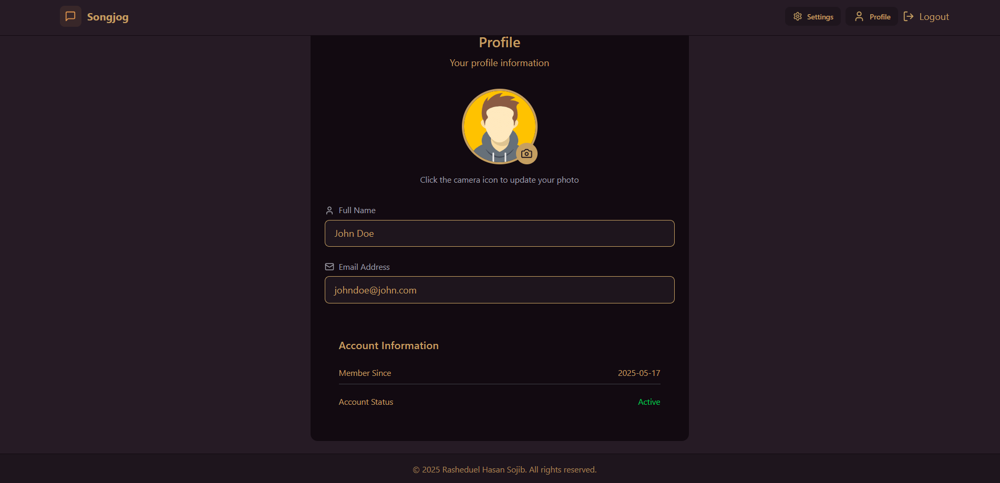
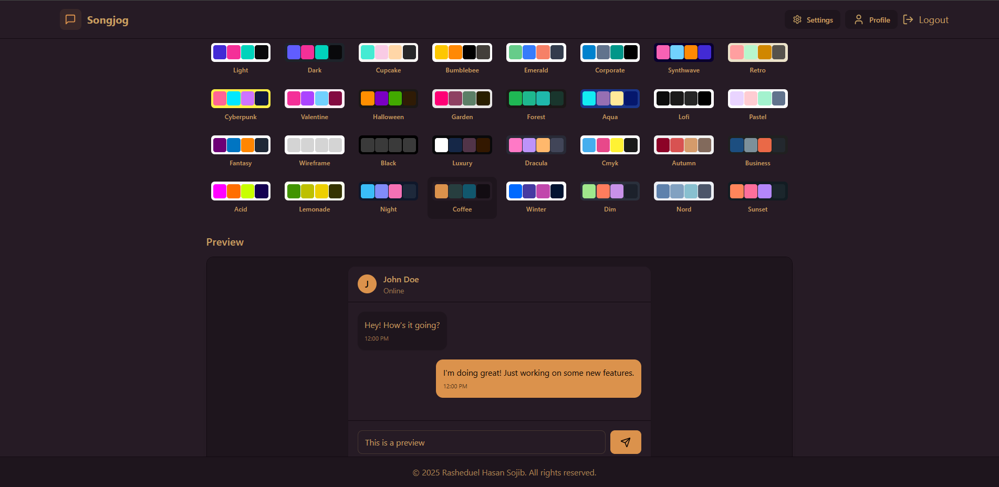

# SongJog Chat

<div align="center">
  
  <br />
  
  <br />
  <p>
    <b>A real-time chat application built with React and Node.js.</b>
  </p>
</div>

## 📸 Screenshots

<div align="center">
  <h3>Authentication</h3>
  
  <br />
  <em>Login Interface</em>
  
  <br /><br />
  
  
  <br />
  <em>Signup Interface</em>
  
  <br /><br />
  
  <h3>Main Features</h3>
  
  <br />
  <em>Chat Sidebar with Conversations</em>
  
  <br /><br />
  
  
  <br />
  <em>Main Chat Interface</em>
  
  <br /><br />
  
  <h3>User Features</h3>
  
  <br />
  <em>User Profile Page</em>
  
  <br /><br />
  
  
  <br />
  <em>Theme and Settings</em>
</div>

## ✨ Features

- Real-time messaging using Socket.IO
- User authentication and authorization
- Modern UI with Tailwind CSS and DaisyUI
- Responsive design
- Theme support (light/dark mode)
- File sharing capabilities
- User profiles and settings

## 🛠️ Tech Stack

### Frontend
- React
- Vite
- Tailwind CSS
- DaisyUI
- Socket.IO Client
- Zustand (State Management)
- React Router
- Axios

### Backend
- Node.js
- Express.js
- MongoDB
- Socket.IO
- JWT Authentication
- Cloudinary (File Upload)

## 🚀 Getting Started

### Prerequisites
- Node.js (v14 or higher)
- MongoDB
- npm or yarn

### Installation

1. Clone the repository
```bash
git clone https://github.com/yourusername/songjog-chat.git
cd songjog-chat
```

2. Install dependencies
```bash
# Install backend dependencies
cd backend
npm install

# Install frontend dependencies
cd ../frontend
npm install
```

3. Environment Setup
Create `.env` files in both frontend and backend directories:

Backend (.env):
```
PORT=5000
MONGODB_URI=your_mongodb_uri
JWT_SECRET=your_jwt_secret
CLOUDINARY_CLOUD_NAME=your_cloudinary_cloud_name
CLOUDINARY_API_KEY=your_cloudinary_api_key
CLOUDINARY_API_SECRET=your_cloudinary_api_secret
```

Frontend (.env):
```
VITE_API_URL=http://localhost:5000
```

4. Run the application
```bash
# Start backend server (from backend directory)
npm run dev

# Start frontend development server (from frontend directory)
npm run dev
```

## Contributing

1. Fork the repository
2. Create your feature branch (`git checkout -b feature/AmazingFeature`)
3. Commit your changes (`git commit -m 'Add some AmazingFeature'`)
4. Push to the branch (`git push origin feature/AmazingFeature`)
5. Open a Pull Request

## License

This project is licensed under the MIT License - see the LICENSE file for details.

## Author

Rasheduel Hasan Sojib 